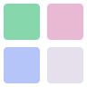
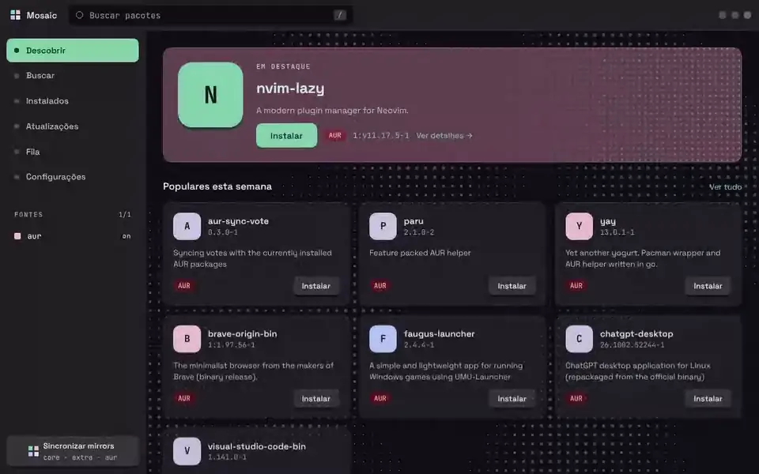
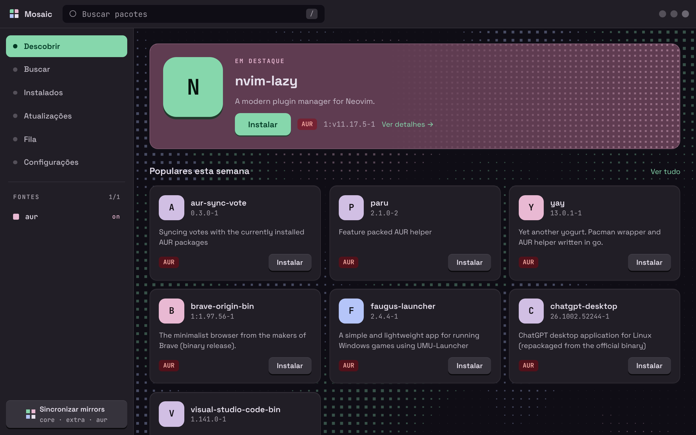
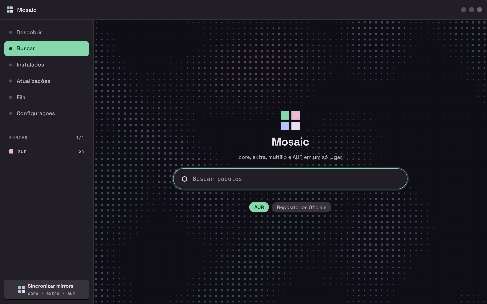
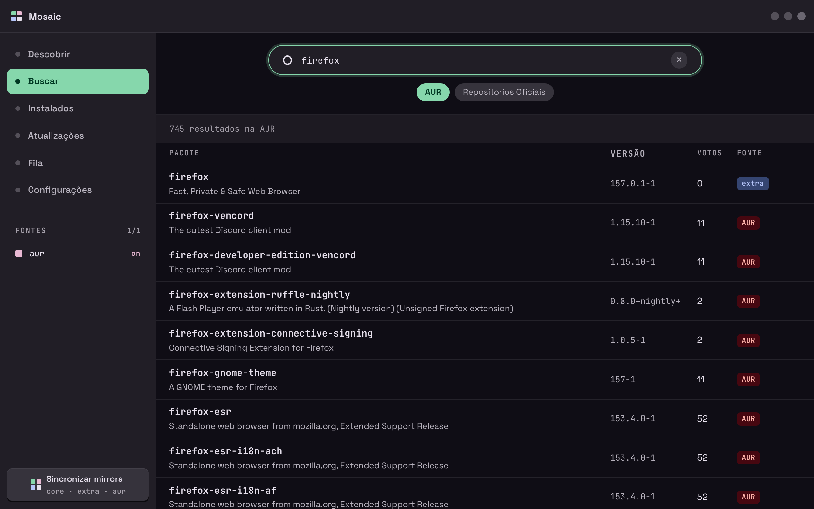
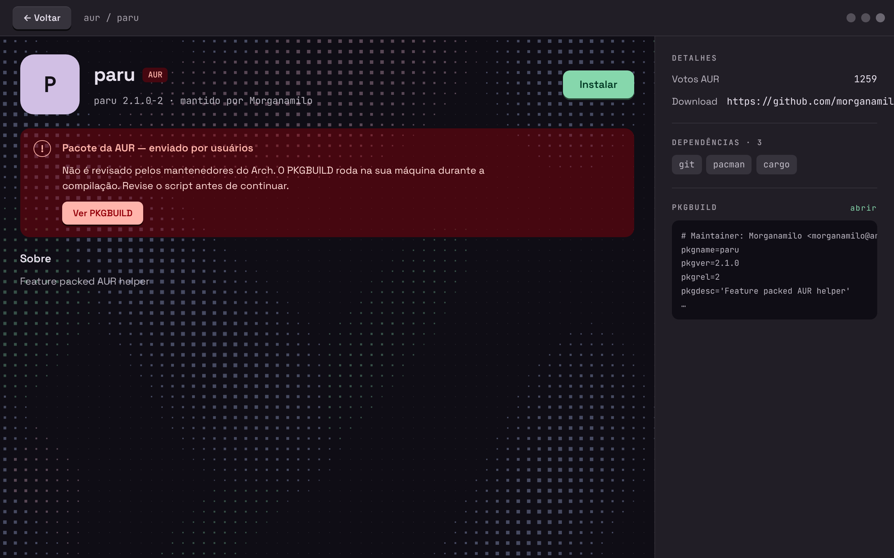
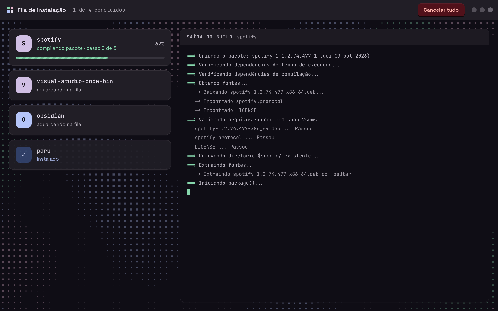
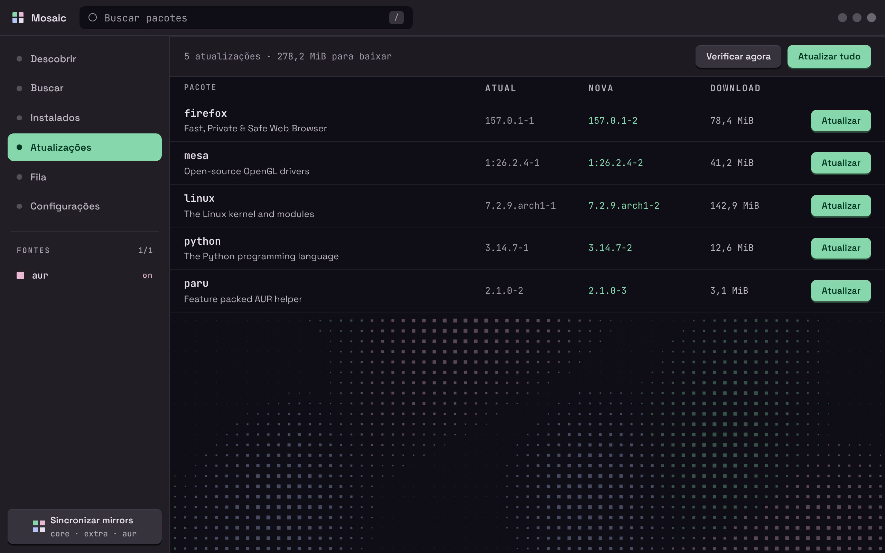

<div align="center">



# Mosaic

### Uma loja de pacotes para o Arch Linux, com a cara do seu wallpaper.



<sub><a href="assetsReadme/mosaic-showcase.mp4">Ver o vídeo em qualidade cheia</a></sub>

<p>
  <a href="#o-que-é">O que é</a> ·
  <a href="#telas">Telas</a> ·
  <a href="#rodando-localmente">Rodando localmente</a> ·
  <a href="#tema-com-o-matugen">Tema</a>
</p>

</div>

> [!NOTE]
> **Sobre o uso de IA.** Grande parte do front-end deste projeto (HTML, CSS e JavaScript) foi escrita com a ajuda de IA. A paleta de cores e o sistema de temas a partir do wallpaper, o layout das telas e o nome são meus, e a identidade visual foi conduzida por mim: a direção de arte, o que entrou, o que saiu e o que precisou ser refeito até ficar com a cara que eu queria.

## O que é

O Mosaic coloca o `paru` atrás de uma interface calma, rápida e legível. Busca, detalhes da AUR, PKGBUILD, instalação e a saída do build ficam no mesmo fluxo, sem abrir terminal.

| Descobrir | Buscar | Instalar com contexto |
| --- | --- | --- |
| Destaque e pacotes populares e mais votados da AUR. | AUR e repositórios oficiais numa busca só, local e instantânea. | Aviso de pacote da AUR, PKGBUILD, dependências e o build ao vivo. |

## Telas

<table>
  <tr>
    <td width="50%">
      <strong>Descobrir</strong><br>
      <sub>O ponto de entrada: destaque, populares e mais votados.</sub><br><br>
      
    </td>
    <td width="50%">
      <strong>Buscar</strong><br>
      <sub>A tela vazia, com a marca, antes da primeira busca.</sub><br><br>
      
    </td>
  </tr>
  <tr>
    <td>
      <strong>Resultados</strong><br>
      <sub>Versão, votos e fonte de cada pacote, com a AUR sinalizada.</sub><br><br>
      
    </td>
    <td>
      <strong>Detalhes do pacote</strong><br>
      <sub>Aviso da AUR, dependências e o PKGBUILD à mão antes de instalar.</sub><br><br>
      
    </td>
  </tr>
  <tr>
    <td>
      <strong>Fila de instalação</strong><br>
      <sub>Progresso de cada pacote e a saída do build em tempo real.</sub><br><br>
      
    </td>
    <td>
      <strong>Atualizações</strong><br>
      <sub>Versão atual, a nova e o tamanho do download.</sub><br><br>
      
    </td>
  </tr>
</table>

<sub>As telas da fila, das atualizações e do PKGBUILD foram capturadas com dados de exemplo.</sub>


### Leve de propósito

O fundo e a transição são desenhados num Web Worker com `OffscreenCanvas`, fora da thread que carrega as páginas e responde aos cliques. A animação não disputa tempo com a interface, só redesenha os pixels que mudaram e para por completo quando a janela perde o foco. As fontes são servidas pelo próprio app, e listas longas só montam o que está na tela.

## Funcionalidades

- Busca local em SQLite com full-text na AUR, core e extra, ordenada por correspondência e popularidade.
- Página do pacote com dependências, votos, mantenedor, link do projeto e PKGBUILD da AUR.
- Instalação em fila com o `paru`, um pacote por vez, e a saída do build ao vivo.
- Tema gerado a partir do wallpaper pelo Matugen.
- Atalho <kbd>/</kbd> para ir direto à busca.
- Movimento reduzido respeitado: as animações viram fades curtos e o fundo fica parado.

### Em desenvolvimento

- Cancelar uma instalação em andamento.
- Telas de Instalados e Configurações (salvar preferências).
- Atualizações e contagens lidas do sistema.
- Ligar e desligar fontes de pacote pela barra lateral.
- Rota de sincronização dos bancos (`/syncDb`) ligada à tecla "Sincronizar mirrors".
- Builds com limite de CPU e memória, para um build pesado não travar a máquina.

## Stack

| Camada | Tecnologia |
| --- | --- |
| Backend | Python + Flask |
| Interface desktop | pywebview (Qt WebEngine) |
| Pacotes | paru, AUR e repositórios oficiais |
| Dados | SQLite + busca full-text (FTS5) |
| Interface | HTML, CSS e JavaScript, sem framework; canvas num Web Worker |
| Fontes | Space Grotesk e JetBrains Mono, servidas localmente |

## Rodando localmente

Instale as ferramentas do Arch necessárias para compilar pacotes da AUR:

```bash
sudo pacman -S --needed base-devel python-setuptools paru
```

Crie o ambiente e instale as dependências:

```bash
python -m venv venv
source venv/bin/activate
pip install -r requirements.txt
```

Abra a aplicação desktop:

```bash
python app.py
```

Para testar só as telas no navegador durante o desenvolvimento:

```bash
flask --app app:app run
```

## Tema com o Matugen

O Mosaic lê as cores de `~/.config/mosaic-store/colors.css`. Aponte um template do Matugen para esse arquivo:

```toml
# ~/.config/matugen/config.toml
[templates.mosaic]
input_path = "~/.config/matugen/templates/mosaic.css"
output_path = "~/.config/mosaic-store/colors.css"
```

O template é um bloco `:root` com as variáveis de cor do app. A lista completa, com os valores padrão, está em [`static/css/theme.css`](static/css/theme.css). Sem o arquivo, o Mosaic usa esses valores padrão.

## Créditos

Space Grotesk e JetBrains Mono são distribuídas sob a SIL Open Font License 1.1 (licenças em [`static/fonts`](static/fonts)).

O README anterior está preservado em [`README.before-showcase.md`](README.before-showcase.md).
