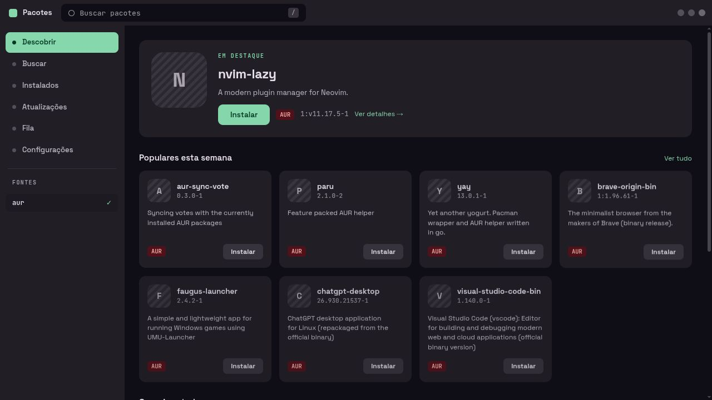
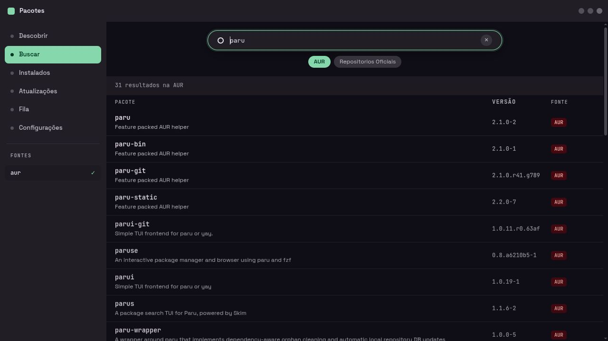
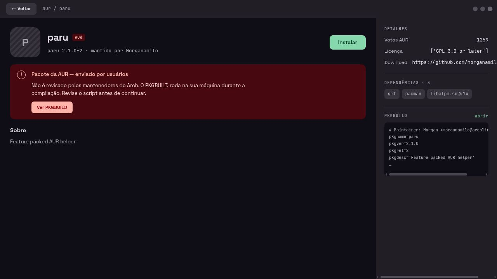
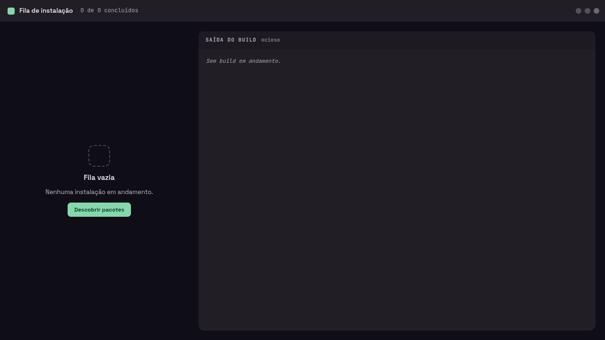
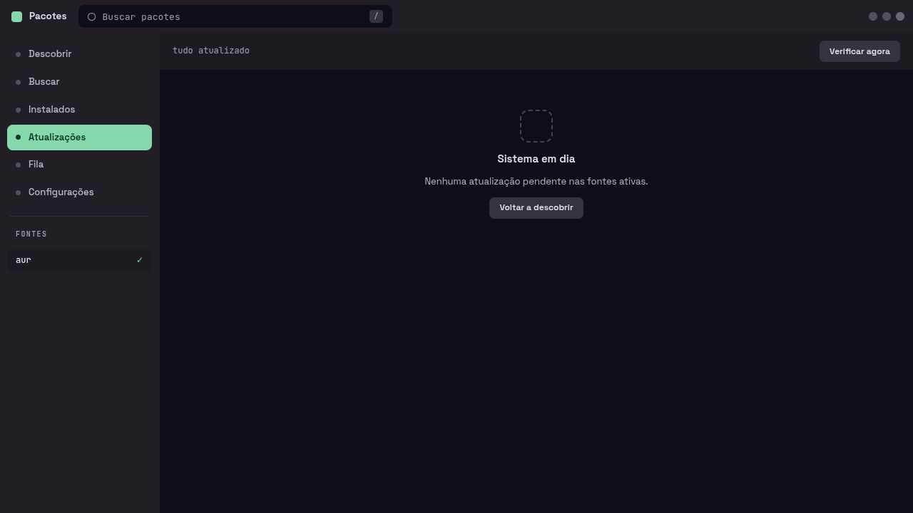

<div align="center">

# Mosaic

### Uma interface desktop para descobrir, instalar e acompanhar pacotes do Arch Linux.



<p>
  <a href="#o-produto-em-uma-olhada">Produto</a> ·
  <a href="#telas">Telas</a> ·
  <a href="#rodando-localmente">Rodando localmente</a>
</p>

</div>

> O Mosaic coloca o `paru` atrás de uma interface calma, rápida e legível — com busca, detalhes da AUR, instalação e saída do build no mesmo fluxo.

<video src="assetsReadme/showcase.mp4" controls width="100%"></video>

## O produto em uma olhada

| Descobrir | Pesquisar | Instalar com contexto |
| --- | --- | --- |
| Destaques e pacotes populares em cards compactos. | AUR e repositórios oficiais em uma busca única. | Avisos de segurança, PKGBUILD, dependências e progresso visíveis. |

### A linguagem visual

Cada pacote é uma peça do mosaico. A marca são quatro blocos, um em cada cor do tema; atrás do conteúdo, uma grade de pixels em retícula muda de cor devagar, e a troca de tela é uma onda desses mesmos pixels saindo de onde foi o clique. Os botões são teclas: cor chapada e uma borda que some quando a tecla desce.

As cores vêm do wallpaper, geradas pelo [Matugen](https://github.com/InioX/matugen) em `~/.config/aurora-store/colors.css` — nenhuma cor é fixa no código. Tipografia em **Space Grotesk** com **JetBrains Mono**, servidas pelo próprio app.

## Telas

<table>
  <tr>
    <td width="50%">
      <strong>Descobrir</strong><br>
      <sub>O ponto de entrada: destaque e descoberta rápida.</sub><br><br>
      
    </td>
    <td width="50%">
      <strong>Buscar</strong><br>
      <sub>Resultados da AUR com versão, descrição e fonte.</sub><br><br>
      
    </td>
  </tr>
  <tr>
    <td>
      <strong>Detalhes do pacote</strong><br>
      <sub>PKGBUILD, dependências, votos e o aviso da AUR no lugar certo.</sub><br><br>
      
    </td>
    <td>
      <strong>Fila de instalação</strong><br>
      <sub>Uma área dedicada para acompanhar o build e a saída do terminal.</sub><br><br>
      
    </td>
  </tr>
  <tr>
    <td>
      <strong>Atualizações</strong><br>
      <sub>Estado do sistema e ação de verificação sem ruído.</sub><br><br>
      
    </td>
    <td valign="top">
      <strong>O fluxo em cinco passos</strong>
      <ol>
        <li>Descubra um pacote.</li>
        <li>Pesquise na AUR ou nos repositórios oficiais.</li>
        <li>Leia detalhes e revise o PKGBUILD.</li>
        <li>Coloque a instalação na fila.</li>
        <li>Acompanhe o build em tempo real.</li>
      </ol>
    </td>
  </tr>
</table>

## Funcionalidades

- Busca de pacotes da AUR com ordenação por correspondência e popularidade.
- Navegação entre descoberta, busca, fila e atualizações.
- Tela de detalhes com dependências, votos, mantenedor, link do projeto e PKGBUILD.
- Instalação assíncrona usando `paru`.
- Saída do build acompanhada em tempo real.
- Cancelamento gracioso com `SIGINT`, permitindo que `paru` e `makepkg` limpem o processo.
- Elevação de privilégios via `pkexec` e Polkit.
- Tema personalizável por CSS, aplicado por cima da paleta base.

## Stack

| Camada | Tecnologia |
| --- | --- |
| Backend | Python + Flask |
| Interface desktop | pywebview |
| Pacotes | paru, AUR e repositórios oficiais |
| Dados | SQLite + busca full-text |
| Estilo | HTML, CSS, Canvas em Web Worker, Space Grotesk e JetBrains Mono |
| Privilégios | Polkit / `pkexec` |

## Rodando localmente

Instale as ferramentas do Arch necessárias para compilar pacotes da AUR:

```bash
sudo pacman -S --needed base-devel python-setuptools paru
```

Crie o ambiente e instale as dependências:

```bash
python -m venv venv
source venv/bin/activate
pip install -r requirements.txt
```

Abra a aplicação desktop:

```bash
python app.py
```

Para testar apenas as telas no navegador durante o desenvolvimento:

```bash
flask --app app:app run
```

## Créditos

O projeto nasceu como uma interface gráfica para o `paru`, com identidade própria e foco em tornar o fluxo da AUR mais compreensível.

O README anterior está preservado em [`README.before-showcase.md`](README.before-showcase.md).
